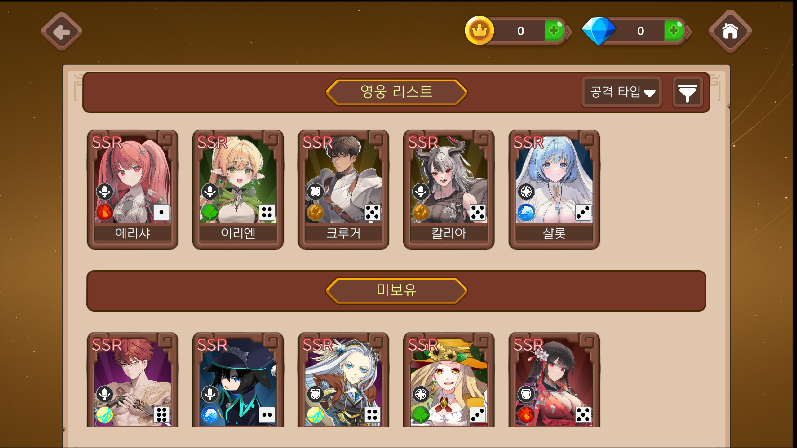
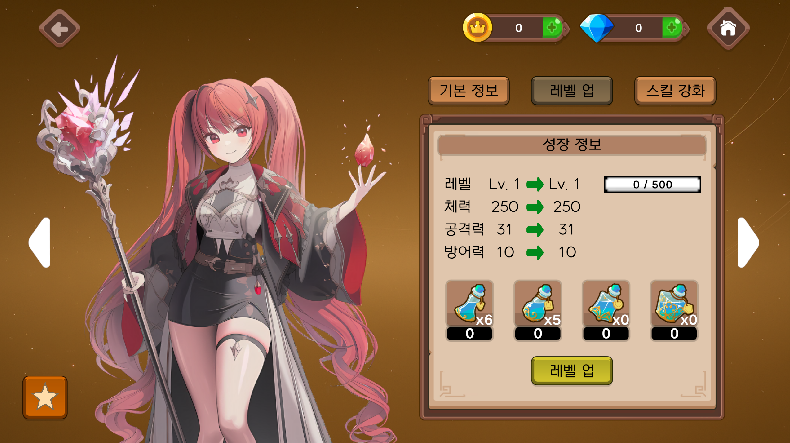
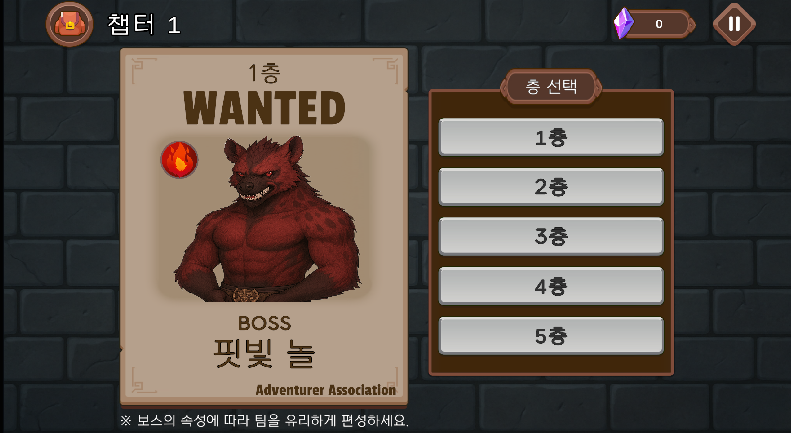
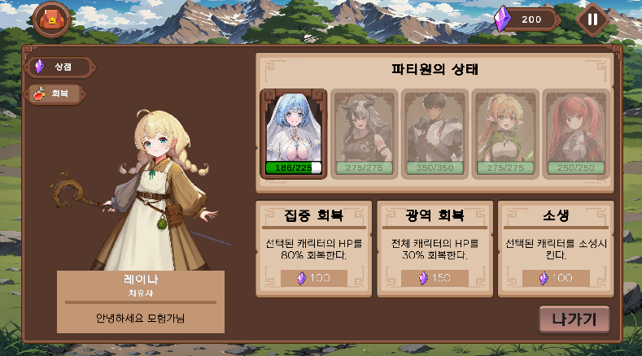

# 미궁 다이스 (Labyrinth Dice)

## 📌 개요

* **장르**: 모바일 턴제 SRPG
* **개발 기간**: 2025.07 \~ 2025.08 (2개월)
* **팀 규모**: 6인 프로젝트
* **본인 역할**: **스테이지 매니저 및 주요 게임 시스템 개발**

※ 저작권 문제를 피하기 위해, 본 레포지토리는 **제가 작성한 스크립트만 제출용으로 모아둔 저장소**입니다.
빌드 파일은 [여기](https://drive.google.com/file/d/1JG1akxKOh-EYhb07p84_bXnLRH5ysh7c/view?usp=sharing)에서 실행할 수 있습니다.

---

## 🔧 담당 업무 및 설계 기여

### 스테이지 관리 (StageManager & Data)

* **설계 방향**: 스테이지 진행을 단순 이벤트 호출이 아니라 **데이터 중심 구조**로 설계.
* **구현 방식**:

  * `StageData`, `ChapterData`를 ScriptableObject 기반으로 관리해 **정적 데이터와 동적 데이터의 분리**를 명확히 함.
  * 진행 상황은 `StageSaveData`로 Json 직렬화하여 **저장/로드 가능**하게 설계.
  * 이 구조를 통해, 스테이지 변경 시 UI/전투/저장 기능이 **중앙 매니저를 통해 일관되게 동작**하도록 구현.

### UI ↔ 로직 연결

* **설계 방향**: UI가 직접 데이터를 수정하지 않고, 반드시 매니저를 통해 변경되도록 함.
* **구현 방식**:

  * `BattleUIController`에서 UI 입력 → StageManager 호출 → 데이터 변경 → UI 업데이트로 **단방향 흐름**을 유지.
  * 이를 통해, UI 변경이 게임 로직에 독립적으로 작동하도록 구조화.

### 오디오 관리 (SoundManager)

* **설계 방향**: 씬 전환과 사용자 설정 변화에도 안정적으로 유지되는 오디오 시스템.
* **구현 방식**:

  * `AudioMixer` 그룹을 BGM/SFX로 분리.
  * UI 슬라이더와 `Exposed Parameters`를 연결해 **실시간 볼륨 조절** 구현.
  * `DontDestroyOnLoad`로 씬 간 지속 관리.
  * PlayerPrefs/Json SaveData에 저장하여 **세션 간에도 일관된 사용자 경험** 보장.

### 보조 개발

* Enemy Prefab 애니메이션 및 애니메이터 세팅
* 로비 캐릭터 보유창 및 인벤토리 UI 연동

---

## 🖥️ 결과물 스크린샷

### 프로젝트에서 제가 작업한 영역의 결과물을 표시합니다.

---

  
- 보유 캐릭터 리스트 데이터를 기반으로 캐릭터 슬롯 UI를 동적으로 생성  
- 각 슬롯에 캐릭터 스프라이트, 이름, 등급 등의 텍스트 정보를 매핑  
- 미보유 캐릭터도 동일한 방식으로 슬롯을 생성 

---

  
- 선택된 캐릭터의 기본 능력치(HP, 공격력, 방어력 등)를 UI에 출력  
- ScriptableObject 기반 캐릭터 데이터를 읽어 뷰어에 반영  

---

  
- 경험치 아이템 사용 시 캐릭터 능력치 증가를 계산하고 UI에 반영  
- 버튼 입력 → 데이터 반영 → UI 업데이트 순서로 동작  

---

  
- 스킬 강화 시 강화 전/후 수치를 비교하여 UI에 표시  
- 강화 비용(재화, 아이템)을 체크하고 조건 충족 시 강화 가능  
- 강화 성공 시 Json SaveData에 반영  

---

  
- 소지 아이템 목록을 리스트로 UI에 동적 생성  
- 아이템 상세 정보를 선택 영역에 표시  
- Json SaveData에 따라 보유 개수 동기화  

---

  
- StageManager와 연동된 층 선택 UI  
- 버튼 입력에 따라 해당 층의 StageData를 로드하도록 구현  
- 보스 정보 및 속성 아이콘을 함께 표시  

---

  
- 전투 진입 시 파티 구성 UI  
- 보유 캐릭터 리스트를 불러와 선택 가능하게 구성  
- 선택된 캐릭터를 전투 Scene으로 전달  

---

  
- 상점 UI에서 아이템 구매 시 재화 차감 및 아이템 지급 로직 연결  
- 판매 아이템 리스트를 ScriptableObject 데이터 기반으로 표시  

---

  
- 힐러 NPC UI에서 선택된 캐릭터 HP 회복 처리  
- 단일/전체 회복, 부활 기능 등 다양한 회복 옵션 제공  
- 사용 시 보유 재화 차감 및 SaveData 업데이트

---
## 🎬 시연 영상

---

## 🚀 성과 & 학습

* **데이터 구조 개선**

  * 아티팩트 세트효과를 `List`에서 `HashSet`으로 리팩토링 → 중복 처리 문제 해결.

* **아키텍처 개선**

  * 프리팹이 직접 데이터를 다루지 않고 **중앙 매니저 패턴**을 도입.
  * 데이터-표현 레이어 분리를 통해 유지보수성과 확장성 강화.

* **직렬화 및 계층 구조 설계 경험**

  * 직렬화 클래스를 활용하여, **Chapter → Stage → Enemy/Item**으로 이어지는 계층적 데이터 구조 구현.

* **성능 최적화**

  * `FindAnyObjectByType`, `FindWithTag` 사용으로 인한 성능 문제를 **사전 참조 및 오브젝트 풀링**으로 해결.
  * 파티 셀렉트 시 매번 객체를 생성·제거하지 않고 **오브젝트 풀링(Object Pooling)** 적용.

